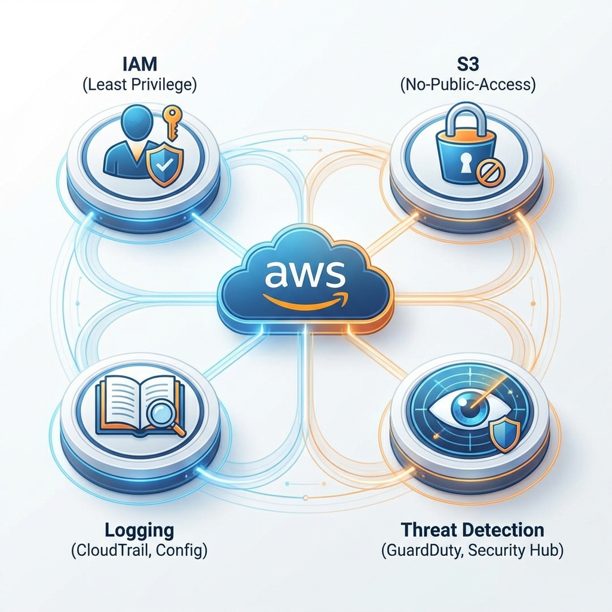

# 🔐 AWS Secure Baseline (Startup-Friendly)



**Enterprise-grade AWS security defaults without enterprise complexity.**

This repository provides a **secure-by-default AWS baseline** that startups can deploy quickly while avoiding common and dangerous misconfigurations.

## 🚀 Deployment Guide

### Option 1: Use as a Module (Recommended)
Add this to your existing Terraform configuration:

```hcl
module "security_baseline" {
  source = "github.com/digikraaft/aws-secure-baseline"

  environment             = "prod"
  logging_bucket_name     = "my-company-security-logs"
  enable_threat_detection = true # GuardDuty & Security Hub
}
```

### Option 2: Deploy Directly
If you want to use this repository as your standalone security workspace:

1. **Clone the repo**: `git clone https://github.com/digikraaft/aws-secure-baseline.git`
2. **Initialize**: `terraform init`
3. **Customize**: Create a `terraform.tfvars` file:
   ```hcl
   environment         = "prod"
   logging_bucket_name = "my-company-security-logs"
   ```
4. **Apply**: `terraform apply`

## What This Repo Covers

### ✅ Automated via Terraform
- **IAM Hardening**: Strict password policies, least privilege defaults, and **IAM Access Analyzer**.
- **S3 & EBS Guardrails**: Account-level public access block and **Environment-wide EBS encryption**.
- **Centralized Logging**: CloudTrail enabled with **KMS CMK encryption**, integrity checks, and **AWS Config** resource tracking.
- **Threat Detection**: GuardDuty & Security Hub (Optional).


### 📝 Strategic Documentation (Manual Steps)
Some security items cannot (or should not) be fully automated. We provide checklists for:
- [Root Account Lockdown](docs/root-lockdown.md) (MFA, Access Key removal).
- [Audit Checklist](docs/audit-checklist.md).
- [Threat Modeling](docs/threat-model.md).

## 💰 Cost & Production Notes

> [!IMPORTANT]
> **GuardDuty & Security Hub** are optional but **strongly recommended for production**.
> Note: These services incur small additional costs. For small startups, this usually ranges from $1-$10/month depending on log volume.

## Automation Boundaries
We intentionally balance automation with safety. 
- **Root MFA**: Must be done manually to ensure the hardware/virtual token is securely held.
- **IAM Users**: We recommend using IAM Identity Center (SSO), so this baseline focuses on account-level policies rather than individual user creation.

## Philosophy
> Make the secure path the default path.